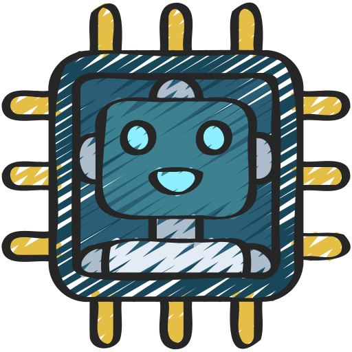

LOLESXi is a curated list of living off the land behaviours observed via public reporting.

Please refer to `NOTICE.md` for license information.

    
    
    

# Living Off the Land ESXi

## Goal

The goal of the LOLESXi project is to identify, track, and document native VMware ESXi binaries and scripts that adversaries utilise during offensive campaigns. By cataloging these tools, the project aims to raise awareness and provide information to enhance detection capabilities.

## Criteria

The binary/script must contain any of the following:

* Be natively available in VMWARE ESXi.
* Have been documented via CTI or open source offensive security content.

Interesting functionality can include:

* Terminate Process
* Lists VMs
* Terminate Running VM
* System Information
* Account Enumeration
* Find Files
* Remove Evidence
* Find and Replace
* Change File Permission
* Discover storage
* Enable Service
* Disable Startup
* Inhibit Recovery
* Power off VM
* Stop Service
* Adjust Performance
* Replace File
* Timestomp
* Change Display Information
* Disable Service
* Discover Network Info
* Software Operation

## Contributing

If you would like to contribute, please review the contributing guidelines located here: https://github.com/LOLESXi-Project/LOLESXi/master/CONTRIBUTE.md

A template for the required format has been provided here: https://github.com/LOLESXi-Project/LOLESXi/master/YML-Template.yml

## The History of the LOLBin

The phrase "Living off the land" was coined by Christopher Campbell (@obscuresec) & Matt Graeber (@mattifestation) at [DerbyCon 3](https://www.youtube.com/watch?v=j-r6UonEkUw).

## The History about this project

The inspiration to create this project is based on the session [Defending and Investigating Hypervisors](https://www.youtube.com/watch?v=lJwc_UgzbO4) by Anurag Khanna and Thirumalai Natarajan at the SANS DFIR Summit 2023.
Our primary maintainer is ([@blueteam0ps_](https://twitter.com/blueteam0ps_))

## Maintainers

The following folks help maintain the LOLESXi Project on their personal time:

* Wietze Beukema ([@wietze](https://twitter.com/wietze))

## Thanks

As with many open-source projects, this one is the product of a community and we would like to thank ours:

* The LOLBAS team providing the theme for the project.
* The logo for project was from Flaticon and was designed by juicy_fish.

## Notice

* Please refer to NOTICE.md for license information